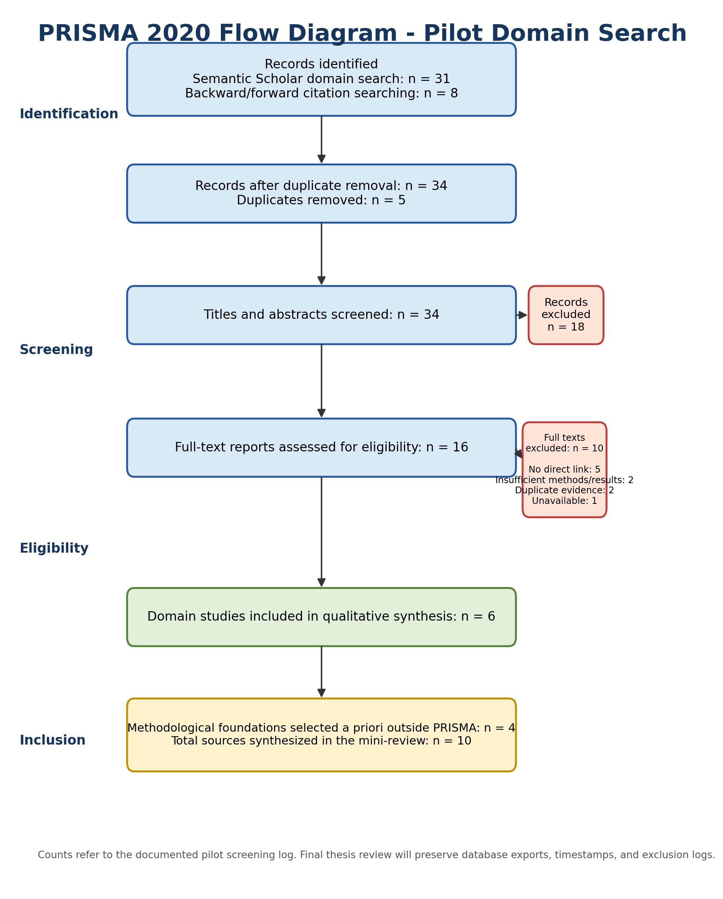

**UNIVERSIDAD NACIONAL MAYOR DE SAN MARCOS**

**Faculty of Systems and Informatics Engineering - Graduate Unit\**
Doctoral Program in Deep Technologies with a Focus on Artificial Intelligence and Emerging Technologies

Mini Systematic Literature Review v1.1

**Six search-retrieved domain studies + four a priori methodological foundations + PRISMA 2020 flow + gap analysis**

| **Course** | Research Methods and Scientific Integrity in AI and Advanced Technologies |
|:---|:---|
| **Instructor** | Dr. Loveleen Gaur |
| **Student** | Luis Quispe Inquil |
| **Deliverable** | Session 4 revised deliverable |
| **Revision date** | 17 June 2026 |

| **Revision note:** The PRISMA flow now reports a complete and internally reconciled pilot domain search. Six mining/domain studies are counted inside the PRISMA flow. Four methodological foundations (CatBoost, SHAP, River, and ADWIN) were selected a priori and are reported outside the PRISMA count. Publisher metadata and DOI details were checked before this revision. |
|----|

# Abstract

This pilot mini-systematic review identifies evidence linking blast design, fragmentation, and comminution performance, and maps methodological foundations for probabilistic, adaptive, and interpretable prediction. A documented domain search yielded six included mining studies after screening. Four pre-specified methodological foundations were then added outside the PRISMA flow to support the candidate artifact components. Domain evidence consistently supports the physical and operational link between blasting and downstream performance, while gaps remain in uncertainty calibration, temporal adaptation, data leakage control, explanation stability, and Peruvian validation. The search and screening process are documented for repeatability; the full doctoral review will preserve database exports, deduplication records, and screening decisions.

# 1. Review question

What scientific evidence links blast-design and geotechnical variables to crushing or comminution energy demand, and what methodological foundations support probabilistic prediction, temporal adaptation, drift detection, and interpretable modeling?

# 2. Adapted CIMO framework

| **Element** | **Definition** |
|:---|:---|
| Context | Open-pit mining, with emphasis on copper and the mine-to-plant interface. |
| Intervention | Blast design, integrated data, and predictive artifacts. |
| Mechanism | Fragmentation, geomechanics, material traceability, tabular learning, uncertainty, and temporal adaptation. |
| Outcomes | Power, specific energy, throughput, peak-load risk, predictive error, calibration, stability, and explanation quality. |

# 3. Search protocol

Pilot search date: 13 June 2026. Main discovery source: Semantic Scholar. Supplementary identification: backward and forward citation searching from seed papers. The counts below refer to the documented pilot screening log used for this course deliverable. The final thesis review will retain database export files, timestamps, query syntax by database, duplicate-resolution records, and full-text exclusion reasons.

## 3.1 Domain search string

(“blast design” OR blasting OR fragmentation OR “powder factor” OR “rock fragmentation”) AND (“primary crusher” OR crusher OR crushing OR comminution OR “mine-to-mill” OR “mine-to-crusher”) AND (energy OR power OR “specific energy” OR throughput) AND (model\* OR predict\* OR simulation OR “machine learning”)

## 3.2 Eligibility criteria

| **Decision** | **Rule** |
|:---|:---|
| Include | Peer-reviewed domain study or review relevant to blast-fragmentation and crushing/comminution performance; 2017-2026; English or Spanish; extractable method and finding; mining or mineral-processing context. |
| Exclude | No direct link to blasting/fragmentation and downstream operation; promotional material; duplicate report; insufficient methodological detail; inaccessible full text for the pilot review. |
| Methodological foundations outside PRISMA | Seminal or primary tool papers pre-specified for CatBoost, SHAP, River, and ADWIN. These support the artifact design but are not treated as domain-search hits. |

# 4. PRISMA 2020 flow

*Figure 1. Identification, screening, eligibility, and inclusion for the pilot domain search. The four methodological foundations are reported separately and do not inflate the six-study PRISMA inclusion count.*

# 5. Six domain studies included through the PRISMA process

| **Study** | **Context/method** | **Main finding** | **Relevance and limitation** |
|:---|:---|:---|:---|
| Lastra et al. (2021) | Simulation of geotechnical ore properties and blast design in comminution circuits. | Blast design and ore properties alter overall circuit performance. | Strong Mine-to-Mill anchor; simulation rather than adaptive online validation. |
| Nikkhah et al. (2022) | Fragmentation and mining-performance analysis at Sarcheshmeh copper mine. | Fragmentation affects downstream operational performance; relationships are site-specific. | Empirical copper-mine evidence; only 20 studied blast blocks for key analyses and no probabilistic energy model. |
| Yamashita et al. (2021) | Review of cone-crusher modeling and control from 1972-2020. | Field is moving toward empirical, mechanistic, data-driven, and plant-wide approaches. | Supports data-driven modeling; not a blast-to-energy linkage study. |
| Navarro Torres et al. (2024) | Mine-to-Crusher model with blast-pile image analysis and operating-cost calibration in Brazil. | Fragment size integration supports cost optimization across blasting to primary crushing. | Close Latin American precedent; focuses on cost and P90 rather than adaptive energy prediction. |
| Saldana et al. (2024) | Review of Kuz-Ram applications in Mine-to-Mill integration. | Literature evolved from simulation to practical and geometallurgical integration. | Maps integration trends; highlights site specificity and limited end-to-end integration. |
| Losaladjome Mboyo et al. (2024) | Theoretical assessment of burden, spacing, stemming, and powder factor in copper-ore comminution. | Finer modeled X80 increased throughput and reduced specific energy and operating cost. | Direct energy relevance; primarily model-based rather than observed adaptive prediction. |

# 6. Four methodological foundations selected a priori outside PRISMA

| **Foundation** | **Methodological contribution** | **Role and caution** |
|:---|:---|:---|
| Prokhorenkova et al. (2018) - CatBoost | Ordered boosting and categorical-feature processing designed to reduce prediction shift and target leakage. | Candidate offline tabular predictor; must still be compared against simpler baselines. |
| Lundberg and Lee (2017) - SHAP | Unified additive feature-attribution framework for local explanations. | Supports explanation; operational validity and temporal stability require separate evaluation. |
| Montiel et al. (2021) - River | Library and architecture for dynamic data streams and continual learning. | Supports sequential residual correction and prequential evaluation when data density is adequate. |
| Bifet and Gavaldà (2007) - ADWIN | Adaptive-window method for detecting distribution change in data streams. | Supports drift monitoring; false alarms and sample-size requirements must be evaluated against scheduled retraining. |

# 7. Critical synthesis

Domain evidence converges on a physically and operationally meaningful relationship among blast design, fragmentation, and downstream performance. However, the evidence base is heterogeneous: it includes simulations, reviews, site-specific observational analyses, and economic models. It does not yet establish that a hybrid online architecture is superior to simpler periodic retraining. The revised protocol therefore treats online learning as a conditional hypothesis rather than an assumed contribution.

The six domain studies support the problem and context. The four methodological foundations support candidate mechanisms, but they do not constitute evidence that the integrated architecture will work in a mine. That claim must be established through target-specific temporal evaluation, leakage control, policy comparison, calibration, ablation, and reproducibility.

# 8. Gap-analysis table

| **Gap type** | **Evidence** | **Candidate gap** | **Protocol response** |
|:---|:---|:---|:---|
| Knowledge | Domain studies link blast design to downstream performance, but do not quantify the incremental value of uncertainty, adaptation, and explanation together. | How much additional predictive and operational value does each artifact layer provide? | Use staged ablations and pre-specified acceptance thresholds. |
| Methodological | Most evidence is simulation-based, static, or site-specific; explicit temporal leakage controls and scheduled-vs-online policy comparisons are rare. | Lack of locked temporal tests, prequential comparison, drift false-alarm analysis, and explanation stability. | Use temporal/group splitting, static and scheduled baselines, conditional online evaluation, and versioned audit trails. |
| Contextual | Brazilian, Iranian, Congolese, and broader international cases are represented; no equivalent integrated Peruvian copper case was identified in the pilot set. | Insufficient evidence under Peruvian operating, governance, and geological conditions. | Validate in a Peruvian case and report transfer limits. |
| Theoretical/design | Mine-to-Mill explains physical integration; DSR explains artifact construction; stream-learning papers explain adaptation. | No unified set of design principles links physical traceability, uncertainty, update policy, and explanation governance. | Derive and evaluate transferable design principles rather than claiming novelty from software combination alone. |

# 9. Conclusion

The review supports the scientific relevance of blast-to-crusher energy prediction and the use of data-driven methods, but it also narrows the claim. The doctoral contribution should not be “CatBoost + River + SHAP” as a software bundle. It should be an evidence-based design for traceable, uncertainty-aware, update-governed, and explainable mine-to-plant prediction. The final choice between online and periodic updating must be determined by the actual data inventory and comparative results.

# 10. Reference-verification log

| **Reference** | **Publisher record** | **DOI/record** | **Status** |
|:---|:---|:---|:---|
| Lastra et al. (2021) | Minerals Engineering 170, 107001 | 10.1016/j.mineng.2021.107001 | Verified |
| Nikkhah et al. (2022) | Minerals 12(2), 258 | 10.3390/min12020258 | Verified |
| Yamashita et al. (2021) | Minerals Engineering 170, 107036 | 10.1016/j.mineng.2021.107036 | Verified |
| Navarro Torres et al. (2024) | Mining 4(4), 983-993 | 10.3390/mining4040055 | Verified |
| Saldana et al. (2024) | Minerals 14(11), 1162 | 10.3390/min14111162 | Verified |
| Losaladjome Mboyo et al. (2024) | Minerals 14(12), 1226 | 10.3390/min14121226 | Verified |
| Prokhorenkova et al. (2018) | NeurIPS 31 | No DOI assigned in cited record | Verified |
| Lundberg & Lee (2017) | NeurIPS 30 | No DOI assigned in cited record | Verified |
| Montiel et al. (2021) | JMLR 22(110), 1-8 | JMLR record; no DOI in cited record | Verified |
| Bifet & Gavaldà (2007) | SIAM SDM, 443-448 | 10.1137/1.9781611972771.42 | Verified |

# 11. References

Bifet, A., & Gavaldà, R. (2007). Learning from time-changing data with adaptive windowing. In Proceedings of the 2007 SIAM International Conference on Data Mining (pp. 443-448). https://doi.org/10.1137/1.9781611972771.42

Lastra, G., Jokovic, V., & Kanchibotla, S. (2021). Understanding the impact of geotechnical ore properties and blast design on comminution circuits using simulations. Minerals Engineering, 170, 107001. https://doi.org/10.1016/j.mineng.2021.107001

Losaladjome Mboyo, H., Huo, B., Mulenga, F. K., Mabe Fogang, P., & Kalenga Kaunde Kasongo, J. (2024). Assessing the impact of surface blast design parameters on the performance of a comminution circuit processing a copper-bearing ore. Minerals, 14(12), 1226. https://doi.org/10.3390/min14121226

Lundberg, S. M., & Lee, S.-I. (2017). A unified approach to interpreting model predictions. Advances in Neural Information Processing Systems, 30.

Montiel, J., Halford, M., Mastelini, S. M., Bolmier, G., Sourty, R., Vaysse, R., Zouitine, A., Gomes, H. M., Read, J., Abdessalem, T., & Bifet, A. (2021). River: Machine learning for streaming data in Python. Journal of Machine Learning Research, 22(110), 1-8.

Navarro Torres, V. F., Ferreira, F. V., de Carvalho, V. A., Veras, E., & Sitônio, F. F. (2024). Application of blast-pile image analysis in a Mine-to-Crusher model to minimize overall costs in a large-scale open-pit mine in Brazil. Mining, 4(4), 983-993. https://doi.org/10.3390/mining4040055

Nikkhah, A., Vakylabad, A. B., Hassanzadeh, A., Niedoba, T., & Surowiak, A. (2022). An evaluation on the impact of ore fragmented by blasting on mining performance. Minerals, 12(2), 258. https://doi.org/10.3390/min12020258

Prokhorenkova, L., Gusev, G., Vorobev, A., Dorogush, A. V., & Gulin, A. (2018). CatBoost: Unbiased boosting with categorical features. Advances in Neural Information Processing Systems, 31.

Saldana, M., Gallegos, S., Arias, D., Salazar, I., Castillo, J., Salinas-Rodríguez, E., Navarra, A., Toro, N., & Cisternas, L. A. (2024). Applications of Kuz-Ram models in Mine-to-Mill integration and optimization-A review. Minerals, 14(11), 1162. https://doi.org/10.3390/min14111162

Yamashita, A. S., Thivierge, A., & Euzébio, T. A. M. (2021). A review of modeling and control strategies for cone crushers in the mineral processing and quarrying industries. Minerals Engineering, 170, 107036. https://doi.org/10.1016/j.mineng.2021.107036
